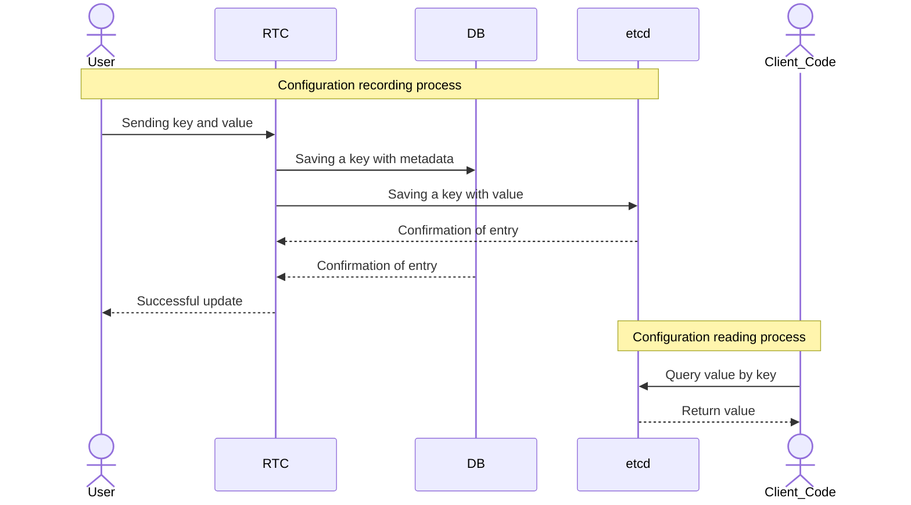

# RTC

Welcome to RTC, your solution for dynamic and efficient configuration management! 🎉

RTC provides a robust platform to manage your application configurations in real-time, allowing for seamless updates and deployments without service interruptions.

## ✨ Key Features
- **Dynamic Configuration Updates:** Modify configurations on the fly and have your applications react instantly.
- **Centralized Management:** A single source of truth for all your application settings across different environments.
- **Environment-Specific Configurations:** Easily manage configurations tailored for development, staging, and production environments.
- **Version Control for Configurations:** Track changes to your configurations, revert to previous versions, and maintain an audit trail.
- **User Management & Audit Logs:** Securely manage users and monitor all configuration changes with detailed audit logs.

## Principal diagram

> [!WARNING]
> Currently, each configuration is limited to **128 keys**. This limitation is due to the underlying `etcd` storage. We are actively exploring solutions to overcome this, but for now, please keep your configurations concise.