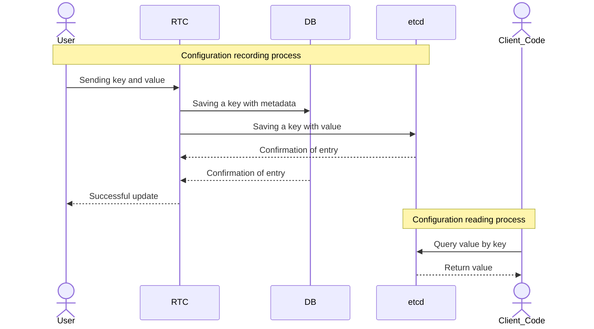

# Welcome to RTC documentation

> [!WARNING]
> Currently, each configuration is limited to **128 keys**. This limitation is due to the underlying `etcd` storage. We are actively exploring solutions to overcome this, but for now, please keep your configurations concise.

## Principal diagram

Explore the following sections to learn how to use RTC:


  
  

